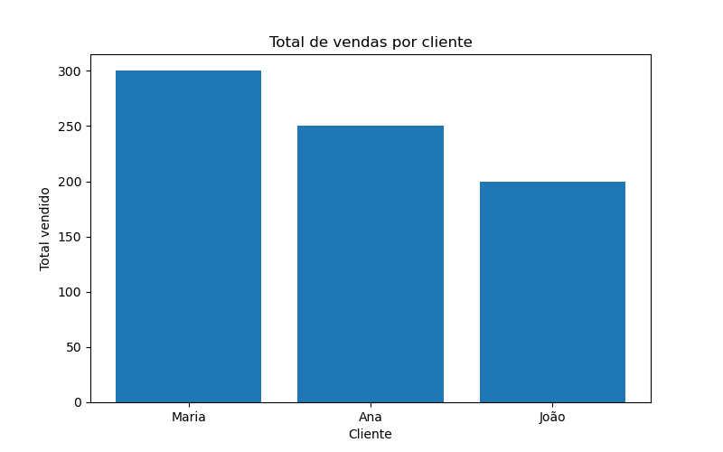

# Análise de Vendas com Python e Pandas

## Objetivo
Este projeto realiza análise de dados de vendas utilizando Python e Pandas, incluindo limpeza de dados, criação de relatórios e visualizações.

## Tecnologias utilizadas
- Python
- Pandas
- Matplotlib
- Excel

## Funcionalidades
- Limpeza de dados
- Criação de categorias de vendas
- Relatório de vendas por cliente
- Relatório de vendas por cidade
- Visualização com gráficos
- Exportação automática de relatórios

## Como executar
1. Abra o notebook `projeto_analise_vendas.ipynb`
2. Execute as células em ordem
3. Os relatórios serão gerados automaticamente

## Exemplo de gráfico



## Autor
Naurk

## Executando o script automático
## Análise com CSV
Este projeto também suporta arquivos CSV.

Execute no terminal:

```bash
python relatorio_vendas.py


